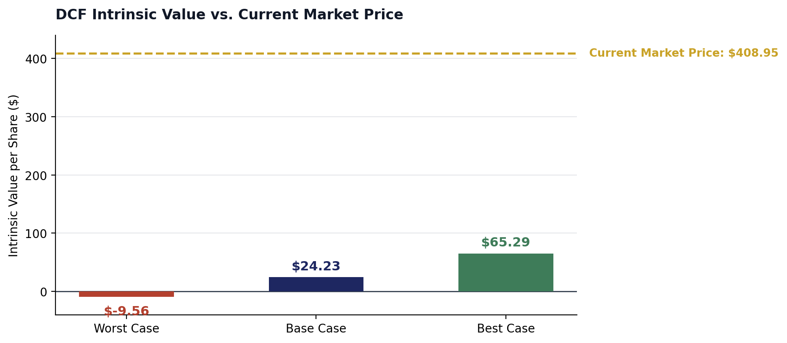
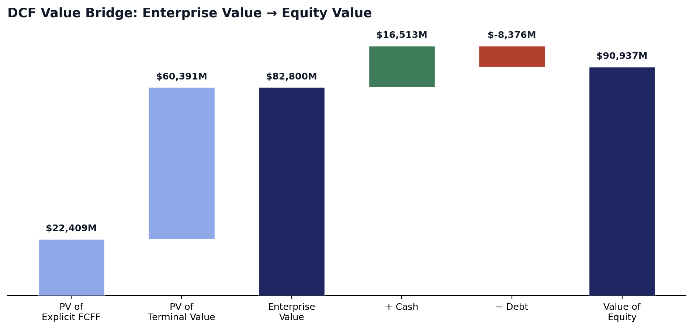
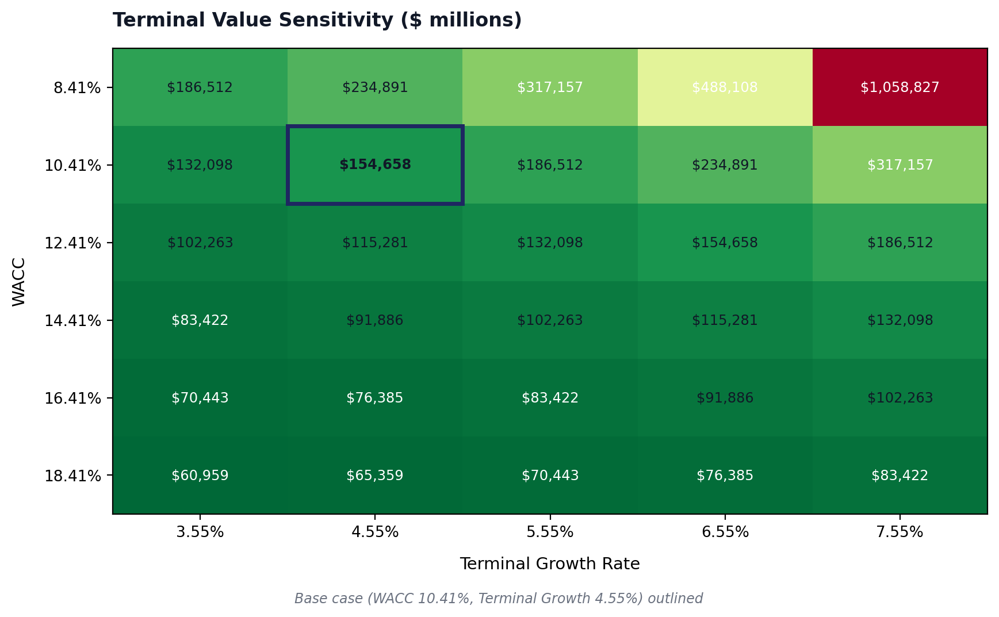
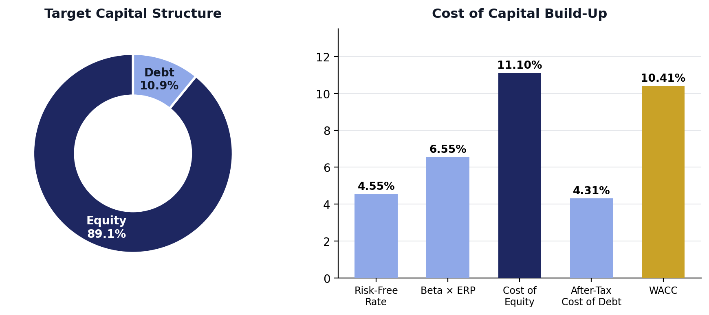
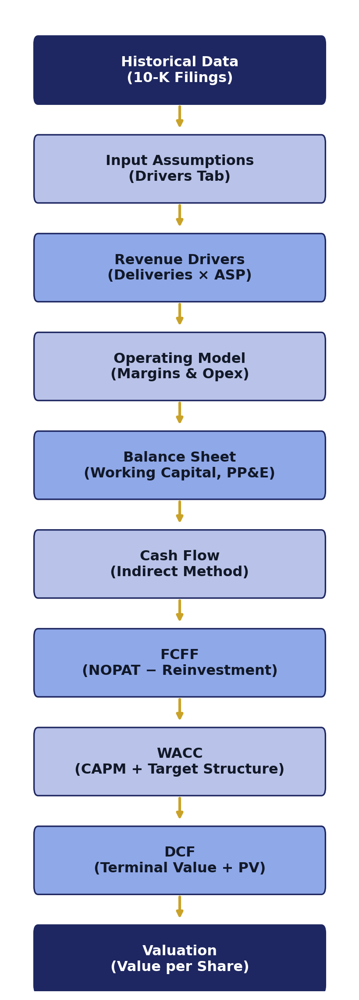
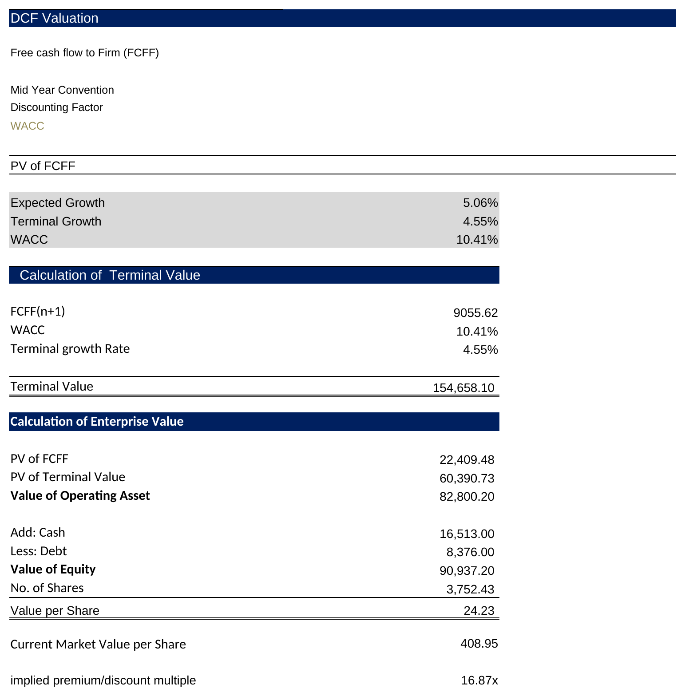
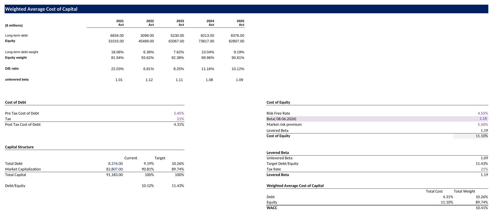
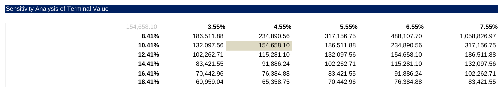

# Tesla Inc. Integrated Financial Model & Valuation

An independent, bottom-up discounted cash flow (DCF) valuation of Tesla, Inc. (NASDAQ: TSLA), built on a fully integrated three-statement financial model with explicit operating drivers, a Damodaran-consistent cost of capital framework, and scenario analysis.

**Prepared by:** Monojit Samanta · **Version:** 1.0 · **Date:** July 2026

## 1. Headline Output

| | |
|---|---|
| **DCF Intrinsic Value per Share (Base Case)** | $24.23 |
| **Current Market Price** | $408.95 |
| **Implied Price / Intrinsic Value Multiple** | 16.9x |
| **WACC** | 10.41% |
| **Cost of Equity** | 11.10% |
| **Levered Beta (target capital structure)** | 1.19 |
| **Scenario Range (Worst → Best)** | −$9.56 → $65.29 |

> **On the gap to market price:** this DCF values Tesla's core automotive and energy business exactly as reflected in its financial statements and this model's operating assumptions. It does **not** separately value optionality the market may be pricing in — FSD licensing, autonomous ride-hailing/Robotaxi, Optimus/humanoid robotics, or energy storage scale-up beyond the base forecast. A gap of this size says something about the *scope* of a fundamentals-only DCF, not that the market is irrational or the model is broken.

## 2. Project Description

This project is a fully integrated three-statement financial model and DCF valuation for Tesla, Inc., built from the ground up in Excel. It forecasts vehicle deliveries, pricing, and margins by product line (Model 3, Model S/X, Model Y, Cybertruck, Semi), links those forecasts through a complete income statement, balance sheet, and cash flow statement, and estimates intrinsic value using a bottom-up FCFF discounted cash flow methodology.

It was built as an independent portfolio project to demonstrate financial modeling, corporate finance, and valuation skills applied to a real, publicly traded company — not as investment advice or a research report. Every historical figure traces back to Tesla's public SEC filings; every forecast assumption is documented with its rationale rather than left as an unexplained number.

## 3. Documentation

| Document | Contents |
|---|---|
| [`Tesla_Integrated_Financial_Model_Documentation.pdf`](./Tesla_Integrated_Financial_Model_Documentation.pdf) | 15-page analyst writeup — project overview, workbook structure, assumptions, model design, valuation methodology, key outputs, model checks, limitations, conclusion |
| [`Tesla_Model_Assumptions_Reference.pdf`](./Tesla_Model_Assumptions_Reference.pdf) | Full assumptions register — every input, its value, and its rationale, organized by category (revenue growth, margins, tax, capex, depreciation, working capital, terminal growth, cost of capital, scenario toggle) |
| [`Tesla_Integrated_Financial_Model_Valuation_Presentation.pptx`](./Tesla_Integrated_Financial_Model_Valuation_Presentation.pptx) | 11-slide presentation deck mirroring the documentation structure — suitable for a live walkthrough or recruiter screen |

## 4. Charts

Visual highlights generated directly from the model's calculations — available at full resolution in [`Charts/`](./Charts/).

**Scenario Comparison** — the one chart that tells the whole story at a glance

Intrinsic value per share: Worst / Base / Best vs. current market price.

**DCF Value Bridge**

Enterprise Value → Equity Value, step by step.

**DCF Sensitivity (WACC × Terminal Growth)**

Terminal value ($M) across a range of WACC and growth assumptions — base case outlined.

<table>
<tr>
<td width="50%">

**Cost of Capital Build-Up**

CAPM cost of equity and after-tax cost of debt, blended to WACC.

</td>
<td width="20%">

**Gross & EBIT Margin Trend**

Margin compression as opex converges toward peer-benchmarked levels; min/max labeled.

</td>
</tr>
<tr>
<td width="50%">

**Revenue & Net Income Trend**

Historical actuals (FY2021–2025) vs. Base Case forecast (FY2026–2032); min/max labeled.

</td>
<td width="50%">

**Model Architecture**

How the model flows from historical data through to valuation.

</td>
</tr>
</table>

## 5. Screenshots

Captured directly from the live workbook — available in [`Model_Screenshorts/`](./Model_Screenshorts/).

<table>
<tr>
<td width="50%">

**DCF Valuation**


</td>
<td width="50%">

**Cost of Capital (WACC)**


</td>
</tr>
<tr>
<td width="50%">

**Financial Statements (P&L)**


</td>
<td width="50%">

**Revenue Drivers (Scenario Toggle)**


</td>
</tr>
<tr>
<td width="20%">

**Balance Sheet Check Row**


</td>
<td width="50%">

**Sensitivity Table**


</td>
</tr>
</table>


## 6. Project Objectives

- Build an integrated three-statement model
- Forecast operating performance by segment and product line
- Estimate intrinsic value using DCF
- Analyze business drivers (deliveries, pricing, margins, opex, working capital, capex)
- Demonstrate financial modeling best practices (color coding, integrity checks, scenario toggles)

## 7. Features

- Dynamic assumptions with a single scenario toggle (Best / Base / Worst case)
- Driver-based forecasting by vehicle line and segment
- Full three-statement integration with balance-check integrity rows
- Segment revenue modeling (Automotive + Energy & Other)
- Working capital schedule (DSO / DIO / DPO)
- PP&E schedule with vintage-based depreciation
- Debt/equity financing schedule
- Bottom-up (Hamada) WACC build
- DCF valuation with Gordon Growth terminal value
- Two-way sensitivity analysis (WACC × terminal growth)
- Verified error checks (0 formula errors across 3,357 formulas; balance sheet ties to zero every period)

## 8. Workbook Structure

| Section | Sheets |
|---|---|
| Inputs | Cover, Drivers (global assumptions), historical P&L / Balance Sheet data from 10-K filings |
| Assumptions / Drivers | Deliveries, pricing, and revenue build-up by vehicle line and segment |
| Schedules | PP&E (capex/depreciation), Working Capital (DSO/DIO/DPO), Financing (debt/equity) |
| Financial Statements | Fully linked P&L, Balance Sheet, and Cash Flow |
| Valuation | WACC and DCF Valuation, including the sensitivity table |

38 sheets total, including labeled section-divider tabs for navigation.

## 9. Model Flow

```
Historical Data → Assumptions → Revenue & Margins → 3-Statement Model → FCFF → WACC → DCF → Valuation
```

## 10. Key Assumptions

| Assumption | Value | Why |
|---|---|---|
| Revenue growth | Deliveries × ASP, by line | Bottom-up build reflects product-mix shifts |
| Gross margin | 16.4–18.3% (fcst.) | Anchored to Tesla's own historical average, cross-checked to peers |
| Capex | % of prior-yr PP&E | Ties spending to asset base (28% Base case) |
| Depreciation | 10-yr SL, vintage-based | Each capex tranche depreciates on its own schedule |
| Working capital | 5-yr avg DSO/DIO/DPO | 14.5 / 60.2 / 72.8 days; peer-benchmarked |
| Tax rate | 21.0% (marginal) | U.S. marginal tax rate |
| WACC | 10.41% | CAPM cost of equity + after-tax cost of debt, at target capital structure |
| Terminal growth | 4.55% (= risk-free rate) | Caps terminal value from becoming unbounded |

Full detail and sourcing for every assumption is in `Tesla_Model_Assumptions_Reference.pdf`.

## 11. Financial Concepts Used

Three-Statement Modeling · Free Cash Flow to Firm (FCFF) · WACC · CAPM · Hamada Beta Unlevering/Relevering · Terminal Value (Gordon Growth) · Discounted Cash Flow · Sensitivity Analysis · Operating Leverage · Working Capital Forecasting · Scenario Analysis

## 12. Skills Demonstrated

Financial Modeling · Corporate Finance · Valuation · Forecasting · Accounting · Excel · Scenario Analysis · Investment Analysis · Capital Budgeting · Financial Statement Analysis · Data Structuring

## 13. Folder Structure

```
Tesla-Inc-Integrated-Financial-Model/
│
├── README.md
├── LICENSE
├── Changelog.md
├── Tesla_Inc__Integrated_Financial_Model___Valuation.xlsx
├── Tesla_Integrated_Financial_Model_Documentation.pdf
├── Tesla_Model_Assumptions_Reference.pdf
├── Tesla_Integrated_Financial_Model_Valuation_Presentation.pptx
├── Charts/
│   ├── Revenue_and_Net_Income.png
│   ├── Margin_Trend.png
│   ├── WACC_Buildup.png
│   ├── DCF_Value_Bridge.png
│   ├── Sensitivity_Heatmap.png
│   ├── Scenario_Comparison.png
│   └── Model_Architecture.png
└── Model_Screenshots/
    ├── Cover.png
    ├── DCF.png
    ├── WACC.png
    ├── Financial_Statements.png
    ├── Revenue_Drivers.png
    ├── Sensitivity.png
    └── Balance_Sheet_Check.png
```

## 14. Model Checks

| Practice | Status |
|---|---|
| Balance sheet balances (Assets = Liab. + Equity) | ✓ Zero variance, every period |
| Cash flow reconciles to balance sheet cash | ✓ Zero variance, every period |
| No formula errors (#REF!, #VALUE!, #DIV/0!) | ✓ 0 errors across 3,357 formulas |
| No circular references | ✓ Confirmed |
| No hardcoded values inside calculation formulas | ✓ Inputs isolated to Drivers/comparable tabs |
| Consistent color coding (input / formula / link) | ✓ Applied throughout |
| Assumptions separated from calculations | ✓ Single Drivers tab controls all scenarios |
| Dynamic formulas | ✓ Sensitivity table uses live formulas, not a Data Table |

## 15. Limitations & Risks

- **Forecast uncertainty** — scenario bands vary by driver type (relative % for volumes, fixed points for margins/opex), so Best/Worst are not based on a single uniform adjustment
- **Assumption dependence** — operating expense and working capital peer benchmarks use 2019 data and carry a recency limitation
- **DCF sensitivity** — terminal value, the majority of total value, is highly sensitive to the WACC-minus-growth spread
- **Macroeconomic risk** — risk-free rate, terminal growth, and inflation are point-in-time market inputs that will change as conditions change
- **Company-specific risk** — excludes FSD licensing, Robotaxi, Optimus, and energy storage optionality, which may contribute to the difference between the model value and market price

## 16. Conclusion

This project builds a fully integrated, auditable three-statement financial model and applies a bottom-up DCF valuation to a publicly traded company, from raw 10-K data through to an intrinsic value estimate.

**Learning Outcomes:** applying Damodaran-consistent cost of capital methodology in practice wherever the available data allows; the discipline of building self-checking financial statements; and clearly identifying the limitations of a valuation alongside its conclusion.

**Future Improvements:**
- Scenario manager beyond the current single-toggle approach
- Monte Carlo simulation on key operating drivers
- Relative valuation (comparable company multiples) and a football field summary
- Power BI dashboard layer

## 17. Disclaimer

This project was built for educational and portfolio purposes only. All historical figures are drawn from Tesla, Inc.'s public SEC filings; forward-looking figures are model estimates. This is not investment advice, a research report from a registered investment adviser or broker-dealer, or a recommendation to buy, sell, or hold any security.

---
